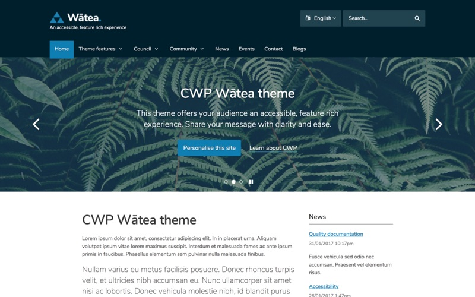

# CWP Wātea theme

[](https://github.com/silverstripe/cwp-watea-theme/actions/workflows/ci.yml)
[](https://www.silverstripe.org/software/addons/silverstripe-commercially-supported-module-list/)

The [Wātea theme](https://github.com/silverstripe/cwp-watea-theme) can be installed on top of the
[Starter theme](https://github.com/silverstripe/cwp-starter-theme) (see
[cascading themes](https://docs.silverstripe.org/en/developer_guides/templates/themes)) to provide a more visually
appealing start to a CWP website.



## Installation

```sh
composer require cwp/watea-theme
```

## Documentation

You can find documentation on how to use this theme in the CWP Developer Documentation:
[Using the Wātea theme](https://github.com/silverstripe/cwp/blob/master/docs/en/01_Working_with_projects/14_Using_the_Watea_theme.md).

You may also find the documentation for the Starter theme useful:
[Customising the starter theme](https://github.com/silverstripe/cwp/blob/master/docs/en/01_Working_with_projects/05_Customising_the_starter_theme.md).

### Development requirements

* [Node and NPM](https://docs.npmjs.com/getting-started/installing-node)
* [Laravel-Mix](https://github.com/JeffreyWay/laravel-mix) and [Webpack](https://webpack.github.io) (via NPM)

## Versioning

This library follows [Semver](http://semver.org). According to Semver, you will be able to upgrade to any minor or patch version of this library without any breaking changes to the public API. Semver also requires that we clearly define the public API for this library.

All methods, with `public` visibility, are part of the public API. All other methods are not part of the public API. Where possible, we'll try to keep `protected` methods backwards-compatible in minor/patch versions, but if you're overriding methods then please test your work before upgrading.
